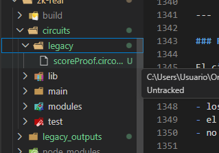

# Fase 2 — Especificación del circuito ZK

## Objetivo

Rediseñar el circuito Zero Knowledge para demostrar de forma criptográficamente sólida que existe un score válido emitido por un emisor autorizado, ligado a una PYME concreta y verificable bajo condiciones públicas sin revelar datos sensibles.

---

## Statement

La prueba demuestra que existe un valor de score `s`, emitido por un emisor autorizado, asociado a una PYME cuya identidad está representada mediante un commitment público `c_id`, tal que:

- el score ha sido correctamente firmado por el emisor autorizado,
- el score está criptográficamente ligado a la identidad de la PYME,
- el valor `s` cumple la condición `s ≥ threshold`,
- la prueba no ha sido reutilizada (protección anti-replay),
- y los datos no han expirado,

todo ello sin revelar ni el valor del score ni la identidad real de la PYME.

---

## Public Inputs

- `threshold`  
  Valor mínimo requerido por el verificador.

- `scoreCommitment`  
  Commitment criptográfico del score y su contexto.

- `pymeIdentityCommitment`  
  Commitment de la identidad de la PYME.

- `issuerPublicKey`  
  Clave pública del emisor autorizado.

- `currentTime`  
  Tiempo actual proporcionado por el verificador.

- `challenge`  
  Valor aleatorio del verificador para evitar replay.

- `nullifier`  
  Identificador único de la prueba, expuesto públicamente para que el contrato o el verificador pueda marcarlo como usado y evitar reutilización.

---

## Private Inputs (Witness)

Los private inputs (witness) son exactamente aquellos valores que el circuito necesita para reconstruir commitments, verificar firmas, comprobar condiciones y validar la credencial, pero que no deben revelarse al verificador.

Regla de diseño:
- Todo valor sensible o secreto permanece en el witness.
- Si un valor participa en un hash o en una firma y no debe revelarse, normalmente debe tratarse como private input.

### Private Inputs exactos

- `rawScore`
- `pymeWallet`
- `modelVersion`
- `timestamp`
- `expiration`
- `salt`
- `R8`
- `S`

### Definición de cada private input

- `rawScore`:
  valor real del score emitido por el emisor y utilizado para comprobar la condición `score >= threshold`.

- `pymeWallet`:
  wallet real de la PYME. Se utiliza para ligar la credencial a una identidad concreta y para reconstruir commitments y nullifiers.

- `modelVersion`:
  identificador de la versión del modelo de scoring que produjo el score. Forma parte del mensaje firmado por el emisor.

- `timestamp`:
  instante de emisión de la credencial. Forma parte del mensaje firmado y permite validar coherencia temporal.

- `expiration`:
  instante de expiración de la credencial. Forma parte del mensaje firmado y permite evitar credenciales caducadas.

- `salt`:
  valor aleatorio secreto utilizado para evitar correlación directa entre credenciales y para construir hashes y nullifiers de forma robusta.

- `R8`:
  componente de la firma EdDSA proporcionada por el emisor.

- `S`:
  componente escalar de la firma EdDSA proporcionada por el emisor.

### Justificación de privacidad

- `rawScore` debe permanecer privado porque revelar el valor exacto del score rompe el objetivo de privacidad del sistema.
- `pymeWallet` debe permanecer privada porque la identidad real no debe exponerse en claro.
- `modelVersion`, `timestamp` y `expiration` forman parte de la credencial firmada y del binding criptográfico, pero no necesitan revelarse directamente si el circuito ya verifica su consistencia.
- `salt` debe permanecer privado porque protege frente a correlación y replay indebido.
- `R8` y `S` se tratan como parte del witness en este diseño para que la firma pueda verificarse dentro del circuito sin exponer más de lo necesario.

### Uso de los private inputs dentro del circuito

Los private inputs se utilizan para:

- reconstruir `issuerMessage`
- reconstruir `scoreCommitment`
- reconstruir `pymeIdentityCommitment`
- verificar la firma EdDSA del emisor
- comprobar la condición `rawScore >= threshold`
- comprobar la validez temporal de la credencial
- construir el `nullifier` para protección anti-replay

### Valores que NO forman parte del witness

Los siguientes valores no forman parte del witness porque deben ser visibles para el verificador o el contrato:

- `threshold`
- `scoreCommitment`
- `pymeIdentityCommitment`
- `issuerPublicKey`
- `challenge`
- `currentTime`
- `nullifier`

### Decisión final

El nuevo circuito de Fase 2 utilizará exactamente ocho private inputs de witness:

`rawScore`, `pymeWallet`, `modelVersion`, `timestamp`, `expiration`, `salt`, `R8`, `S`.

---

## Constraints del Circuito

Los constraints definen exactamente qué condiciones debe verificar el circuito.

Cada constraint representa una igualdad o comprobación lógica que debe cumplirse para que la prueba sea válida.

Si cualquier constraint falla, la prueba es inválida.

### Constraint 1 — Reconstrucción del mensaje firmado

El circuito debe reconstruir el mensaje firmado por el emisor a partir de los valores privados:

```
issuerMessage = H(
    rawScore,
    pymeWallet,
    modelVersion,
    timestamp,
    expiration,
    salt
)
```

Este constraint garantiza que todos los datos de la credencial están ligados criptográficamente.

### Constraint 2 — Consistencia con commitment público

El mensaje reconstruido debe coincidir con el commitment público:

```
issuerMessage == scoreCommitment
```

Este constraint conecta:
- los datos privados
- el valor firmado
- el valor público verificable

### Constraint 3 — Verificación de firma

El circuito debe verificar que la firma del emisor es válida:

```
VerifySignature(
    issuerPublicKey,
    issuerMessage,
    (R8, S)
) == true
```

Este constraint garantiza que el score proviene de un emisor autorizado.

### Constraint 4 — Binding de identidad

El circuito debe comprobar que la identidad comprometida corresponde a la wallet:

```
H(pymeWallet, salt) == pymeIdentityCommitment
```

Este constraint evita que se utilice un score asociado a otra identidad.

### Constraint 5 — Condición de negocio

El score debe cumplir la condición requerida por el verificador:

```
rawScore ≥ threshold
```

Este es el objetivo principal de la prueba.

### Constraint 6 — Validez temporal

El circuito debe verificar que la credencial es válida en el momento actual:

```
timestamp ≤ currentTime ≤ expiration
```

Este constraint evita tanto credenciales futuras (aún no válidas) como credenciales caducadas.

### Constraint 7 — Protección contra replay (nullifier)

El circuito debe comprobar que el nullifier público coincide con el valor reconstruido a partir de los inputs privados y del challenge:

```
H(pymeWallet, challenge, salt) == nullifier
```

Este constraint liga la prueba a un contexto específico y permite que el contrato o el backend del verificador marque el `nullifier` como usado, evitando reutilización.

### Resumen de constraints

El circuito verifica simultáneamente que:

1. Se reconstruye correctamente el mensaje firmado
2. El commitment público coincide con el mensaje
3. La firma del emisor es válida
4. La identidad está correctamente ligada
5. El score cumple la condición requerida
6. La credencial es válida en el momento actual (`timestamp ≤ currentTime ≤ expiration`)
7. La prueba está ligada a un contexto único mediante un `nullifier` público (anti-replay)

---

## Módulos del circuito

### CommitmentVerifier

#### Objetivo

Verificar que los commitments públicos corresponden correctamente a los valores privados del witness, garantizando la integridad y el binding criptográfico de los datos.

#### Inputs

**Públicos:**

- scoreCommitment
- pymeIdentityCommitment

**Privados:**

- rawScore
- pymeWallet
- commitmentSecret
- modelVersion
- timestamp
- expiration

#### Lógica

1. Recalcular el mensaje:

```
issuerMessage = Poseidon(
    rawScore,
    pymeWallet,
    modelVersion,
    timestamp,
    expiration,
    commitmentSecret
)
```

2. Verificar commitment del score:

```
issuerMessage === scoreCommitment
```

3. Recalcular commitment de identidad:

```
identityCommitment = Poseidon(pymeWallet, commitmentSecret)
```

4. Verificar identity commitment:

```
identityCommitment === pymeIdentityCommitment
```

#### Garantías

- No se puede modificar el score sin romper el commitment
- No se puede cambiar la wallet sin invalidar la prueba
- El binding incluye contexto (timestamp, modelo, expiración)
- El commitment está completamente alineado con el mensaje firmado

---

## Assumptions

El circuito no verifica por sí mismo todos los elementos del sistema. Existen propiedades que dependen de componentes externos, del contrato o del verificador.

Estas condiciones deben declararse explícitamente para evitar ambigüedad en la seguridad del sistema.

### Regla general

Todo aquello que no se expresa como constraint dentro del circuito debe considerarse una asunción externa del sistema.

### Assumption 1 — Autorización de la clave pública

Se asume que `issuerPublicKey` corresponde efectivamente a un emisor autorizado.

El circuito puede verificar que una firma es válida respecto a esa clave pública, pero no puede decidir por sí mismo si dicha clave pertenece a una entidad legítima. Esa decisión depende del sistema externo, del contrato o del registro autorizado de emisores.

### Assumption 2 — Registro correcto del commitment

Se asume que `scoreCommitment` está correctamente registrado on-chain o en una fuente pública verificable.

El circuito puede comprobar que los valores privados reconstruyen ese commitment, pero no puede verificar por sí mismo que el commitment fue almacenado correctamente ni que el registro externo sea honesto.

### Assumption 3 — Control externo del nullifier

Se asume que el contrato o el backend del verificador comprueba que el `nullifier` no ha sido utilizado previamente.

El circuito puede reconstruir el nullifier y ligarlo a la prueba comprobando que coincide con el valor público, pero no puede mantener estado global ni marcar por sí mismo si ese nullifier ya fue usado en una verificación anterior.

### Assumption 4 — Generación correcta del challenge

Se asume que `challenge` es generado por el verificador o por una fuente externa fiable y que es fresco para cada sesión.

El circuito puede usar el challenge para construir el nullifier y ligar la prueba a un contexto, pero no puede garantizar por sí mismo que el challenge sea aleatorio, único o reciente.

### Assumption 5 — Generación correcta de la firma por el emisor

Se asume que el sistema del emisor construye correctamente `issuerMessage` y genera la firma EdDSA conforme a la especificación.

El circuito puede verificar la firma recibida, pero no puede auditar el proceso off-chain mediante el cual el emisor generó la credencial.

### Assumption 6 — Referencia temporal externa

Se asume que `currentTime` es proporcionado correctamente por el verificador o por una fuente externa fiable y que refleja un instante temporal válido.

El circuito puede verificar la relación `timestamp ≤ currentTime ≤ expiration`, pero no puede por sí mismo conocer el tiempo real del mundo externo; depende de que `currentTime` sea un valor honesto.

### Resumen de assumptions

El circuito NO verifica por sí mismo:

- que `issuerPublicKey` pertenezca a un emisor autorizado,
- que `scoreCommitment` esté correctamente registrado on-chain,
- que el `nullifier` no haya sido usado previamente,
- que `challenge` haya sido generado por el verificador de forma fresca,
- que el emisor haya ejecutado correctamente su lógica off-chain,
- que `currentTime` refleje honestamente el tiempo real del sistema.

Estas propiedades deben ser garantizadas por el contrato, el backend o las reglas operativas del sistema.

---

## Binding criptográfico

El sistema define un binding criptográfico que liga de forma inmutable todos los elementos relevantes de la credencial de score.

Este binding garantiza que el score no puede ser separado de su contexto (identidad, metadatos, validez temporal) sin invalidar la prueba.

---

### Definición del mensaje criptográfico

Se define el mensaje base de la credencial como:

```
issuerMessage = Poseidon(
    score,
    pymeWallet,
    modelVersion,
    timestamp,
    expiration,
    salt
)
```

donde:

- `score`: valor del score emitido
- `pymeWallet`: identidad de la PYME
- `modelVersion`: versión del modelo de scoring
- `timestamp`: momento de emisión
- `expiration`: momento de expiración
- `salt`: valor aleatorio para evitar colisiones y correlación

---

### Propiedades del binding

El binding criptográfico garantiza:

- **Integridad:** cualquier cambio en los datos modifica el hash
- **Inmutabilidad:** no se puede alterar ningún campo sin invalidar la credencial
- **No ambigüedad:** el orden de los campos es fijo y forma parte de la definición
- **Resistencia a colisiones:** proporcionada por Poseidon

---

### Relación con el commitment público

El valor público `scoreCommitment` se define como:

```
scoreCommitment = issuerMessage
```

Esto implica que:

- el commitment público representa exactamente la credencial firmada
- no existe duplicidad entre "mensaje firmado" y "commitment"
- el circuito solo necesita verificar una igualdad

**Nota:**

En esta versión del sistema, `scoreCommitment` coincide directamente con `issuerMessage`.

En versiones futuras, podría separarse en:
- mensaje firmado
- commitment independiente

---

### Binding de identidad

La identidad de la PYME se liga adicionalmente mediante:

```
pymeIdentityCommitment = Poseidon(
    pymeWallet,
    salt
)
```

Esto garantiza que:

- el score está ligado a una identidad concreta
- no se puede reutilizar el score de otra wallet
- la identidad real no se revela

---

### Consistencia requerida

Para que el sistema sea correcto, debe cumplirse:

- el emisor construye `issuerMessage` exactamente con este orden
- el circuito reconstruye `issuerMessage` de la misma forma
- el commitment público coincide con `issuerMessage`
- la firma se realiza sobre `issuerMessage`

Cualquier desviación en:

- orden de campos
- función hash
- codificación de datos

invalidará la prueba.

---

### Separación de responsabilidades

El binding criptográfico conecta tres elementos:

- **Mensaje firmado (`issuerMessage`)**
- **Commitment público (`scoreCommitment`)**
- **Inputs privados del circuito**

El circuito actúa como verificador de consistencia entre estos tres elementos.

---

### Resultado del binding

Gracias a este diseño:

- el score no puede modificarse sin romper la firma
- la identidad no puede cambiar sin romper el commitment
- los metadatos no pueden alterarse sin invalidar la prueba
- la credencial completa queda ligada como una única unidad criptográfica

---

## Arquitectura del circuito (modular)

El circuito se divide en módulos independientes, cada uno responsable de verificar una propiedad concreta del sistema.

Esta separación permite:

- claridad en el diseño
- facilidad de auditoría
- reutilización de componentes
- reducción de errores al modificar lógica

Cada módulo implementa un conjunto específico de constraints.

### 1. CommitmentVerifier

Responsabilidad:

Verificar que los valores privados reconstruyen correctamente el commitment público.

Inputs:

- rawScore
- pymeWallet
- modelVersion
- timestamp
- expiration
- salt

Output:

- issuerMessage (hash reconstruido)

Constraints:

```
issuerMessage = Poseidon(
    rawScore,
    pymeWallet,
    modelVersion,
    timestamp,
    expiration,
    salt
)

issuerMessage == scoreCommitment
```

### 2. SignatureVerifier

#### Responsabilidad

Verificar que el mensaje estructurado ha sido firmado correctamente por el emisor autorizado.

Este módulo garantiza la autenticidad del score y de todos los datos asociados a la credencial.

---

#### Qué debe comprobar

El módulo debe reconstruir el mensaje firmado a partir de los valores privados:

```
issuerMessage = Poseidon(
    rawScore,
    pymeWallet,
    modelVersion,
    timestamp,
    expiration,
    salt
)
```

Y verificar que la firma es válida respecto a la clave pública del emisor:

```
VerifySignature(
    issuerPublicKey,
    issuerMessage,
    (R8, S)
) == true
```

---

#### Inputs

**Públicos:**

- `issuerPublicKey`

**Privados (witness):**

- `rawScore`
- `pymeWallet`
- `modelVersion`
- `timestamp`
- `expiration`
- `salt`
- `R8`
- `S`

---

#### Outputs (internos al circuito)

El módulo puede exponer una señal interna:

- `isValidSignature`

---

#### Constraints

El módulo impone las siguientes constraints:

```
issuerMessage = Poseidon(
    rawScore,
    pymeWallet,
    modelVersion,
    timestamp,
    expiration,
    salt
)

VerifySignature(
    issuerPublicKey,
    issuerMessage,
    (R8, S)
) == true
```

---

#### Regla de diseño

Este módulo debe ser completamente independiente de:

- commitments públicos (`scoreCommitment`)
- lógica de negocio (`threshold`)
- nullifiers o mecanismos anti-replay
- validación temporal externa

Su única responsabilidad es verificar la firma.

---

#### Idea clave

Este módulo garantiza la **autenticidad criptográfica del sistema**.

Si este módulo falla, el sistema deja de garantizar que el score

### 3. ScoreConstraint

#### Responsabilidad

Verificar que el valor del score cumple la condición mínima requerida por el verificador.

Este módulo implementa la lógica de negocio principal del sistema: demostrar que el score es suficientemente alto sin revelar su valor exacto.

---

#### Qué debe comprobar

El módulo debe verificar que:

```
rawScore ≥ threshold
```

---

#### Inputs

**Públicos:**

- `threshold`

**Privados (witness):**

- `rawScore`

---

#### Outputs (internos al circuito)

El módulo puede exponer una señal interna:

- `isAboveThreshold`

---

#### Constraints

El módulo impone la siguiente constraint:

```
rawScore ≥ threshold
```

En implementación en Circom, esto se realiza mediante un comparador, por ejemplo:

```
GreaterEqThan(rawScore, threshold) == 1
```

---

#### Consideraciones de implementación

- El comparador debe trabajar sobre un número de bits definido (por ejemplo, 32 bits).
- `rawScore` y `threshold` deben estar dentro del rango soportado por el comparador.
- Es recomendable añadir constraints de rango si el dominio del score no está acotado explícitamente.

---

#### Regla de diseño

Este módulo debe ser completamente independiente de:

- commitments criptográficos
- verificación de firmas
- nullifiers o mecanismos anti-replay
- validación temporal

Su única responsabilidad es verificar la condición sobre el score.

---

#### Idea clave

Este módulo implementa la **lógica de negocio del sistema**.

Es reutilizable para distintos casos de uso, como:

- score ≥ threshold
- score dentro de un rango (extensión futura)

### 4. RangeProof

#### Responsabilidad

Verificar que el valor del score se encuentra dentro de un rango público definido por el verificador.

Este módulo extiende la lógica de negocio del sistema para casos en los que no basta con demostrar una cota mínima, sino que se necesita probar que el score pertenece a un intervalo concreto.

---

#### Qué debe comprobar

El módulo debe verificar simultáneamente que:

```
minScore ≤ rawScore ≤ maxScore
```

---

#### Inputs

**Públicos:**

- `minScore`
- `maxScore`

**Privados (witness):**

- `rawScore`

---

#### Outputs (internos al circuito)

El módulo puede exponer señales internas como:

- `isAboveMin`
- `isBelowMax`
- `isInRange`

---

#### Constraints

El módulo impone las siguientes constraints:

```
rawScore ≥ minScore
rawScore ≤ maxScore
```

En una implementación en Circom, esto puede expresarse mediante dos comparadores:

```
GreaterEqThan(rawScore, minScore) == 1
GreaterEqThan(maxScore, rawScore) == 1
```

y opcionalmente:

```
isInRange = isAboveMin * isBelowMax
isInRange == 1
```

---

#### Consideraciones de implementación

- `minScore` y `maxScore` deben ser públicos y estar bien ordenados.
- Es recomendable imponer adicionalmente:

```
minScore ≤ maxScore
```

  para evitar rangos inválidos.

- Igual que en `ScoreConstraint`, los valores deben estar dentro del rango soportado por el comparador en bits.

---

#### Regla de diseño

Este módulo debe ser completamente independiente de:

- commitments
- firmas
- nullifiers
- validez temporal

Su única responsabilidad es verificar una condición de rango sobre el score.

---

#### Idea clave

Este módulo permite soportar casos de uso futuros, por ejemplo:

- demostrar que el score está dentro de una categoría concreta,
- demostrar pertenencia a una banda de riesgo,
- construir pruebas compuestas más expresivas.

Aunque todavía no se use en la versión mínima, conviene diseñarlo desde ahora como módulo separado.

### 5. NullifierVerifier

#### Responsabilidad

Calcular correctamente el nullifier a partir de los datos privados de la PYME y del contexto público de verificación, y comprobar que coincide con el valor público proporcionado.

Este módulo permite ligar la prueba a un contexto específico y habilita la protección contra reutilización (replay).

---

#### Qué debe comprobar

El módulo debe verificar que:

```
nullifier = Poseidon(
    pymeWallet,
    challenge,
    salt
)
```

---

#### Inputs

**Públicos:**

- `challenge`
- `nullifier`

**Privados (witness):**

- `pymeWallet`
- `salt`

---

#### Outputs (internos)

- `computedNullifier`

---

#### Constraints

El circuito debe imponer:

```
computedNullifier = Poseidon(
    pymeWallet,
    challenge,
    salt
)
```

y además:

```
computedNullifier == nullifier
```

---

#### Consideraciones de implementación

- `challenge` debe ser único por sesión y proporcionado por el verificador.
- `salt` debe permanecer secreto para evitar correlación entre pruebas.
- `pymeWallet` liga el nullifier a la identidad de la PYME.

---

#### Regla de diseño

Este módulo:

- NO mantiene estado
- NO detecta reutilización
- NO interactúa con contratos

Solo verifica la correcta construcción del nullifier.

---

#### Idea clave

El circuito garantiza:

✔ que el nullifier está bien calculado  
❌ NO que no haya sido usado antes  

La prevención real del replay depende de un sistema externo.

---

#### Dependencias externas

Para que este mecanismo sea efectivo, el sistema externo debe:

- almacenar nullifiers ya utilizados
- rechazar nullifiers repetidos

---

#### Propósito en el sistema

Este módulo permite:

- ligar la prueba a un contexto único
- evitar reutilización de pruebas
- integrar fácilmente con contratos o backends antifraude

### 6. ExpiryVerifier

#### Responsabilidad

Verificar que la credencial es temporalmente válida en el momento de la verificación.

Este módulo se encarga exclusivamente de la lógica temporal de la credencial, sin ocuparse de firmas, commitments o condiciones de negocio.

---

#### Qué debe comprobar

El módulo debe verificar simultáneamente que:

```
timestamp ≤ currentTime ≤ expiration
```

Esto implica:

- la credencial no puede haber sido emitida en el futuro,
- la credencial no puede estar caducada en el momento de la verificación,
- y existe coherencia temporal interna entre emisión, verificación y expiración.

---

#### Inputs

**Públicos:**

- `currentTime`

**Privados (witness):**

- `timestamp`
- `expiration`

---

#### Outputs (internos)

El módulo puede exponer señales internas como:

- `isIssued`
- `isNotExpired`
- `isTemporallyValid`

---

#### Constraints

El circuito debe imponer las siguientes constraints:

```
timestamp ≤ currentTime
currentTime ≤ expiration
```

Equivalentemente, puede expresarse como:

```
timestamp ≤ currentTime ≤ expiration
```

Opcionalmente, si se quiere explicitar la coherencia interna de la credencial:

```
timestamp ≤ expiration
```

aunque esta condición queda implícita si se verifican las dos anteriores.

---

#### Consideraciones de implementación

- `currentTime` debe ser proporcionado por el verificador o por una fuente pública fiable.
- `timestamp` y `expiration` forman parte de la credencial firmada por el emisor.
- El circuito no puede conocer por sí mismo el tiempo real externo; depende del input público `currentTime`.

---

#### Regla de diseño

Este módulo debe ser completamente independiente de:

- verificación de firmas
- commitments
- score thresholds
- nullifiers

Su única responsabilidad es verificar la validez temporal de la credencial.

---

#### Idea clave

Este módulo garantiza que la prueba solo puede generarse con una credencial temporalmente válida.

No garantiza por sí mismo que `currentTime` sea correcto; eso depende del sistema externo.

---

#### Dependencia externa

La fiabilidad temporal del sistema depende de que `currentTime` sea

### 7. Main (ScoreProof Orchestrator)

#### Responsabilidad

Componer todos los módulos del circuito y definir la prueba ZK completa.

Este módulo no implementa lógica criptográfica propia, sino que coordina los distintos verificadores especializados para producir una única prueba coherente.

---

#### Qué debe hacer

El módulo principal debe:

- declarar todos los inputs públicos del circuito
- declarar todos los inputs privados (witness)
- instanciar los módulos definidos:
  - CommitmentVerifier
  - SignatureVerifier
  - ThresholdProof (o RangeProof)
  - NullifierVerifier
  - ExpiryVerifier
- conectar correctamente las señales entre módulos
- garantizar que todas las constraints se cumplen simultáneamente

---

#### Inputs

**Públicos:**

- `threshold`
- `scoreCommitment`
- `pymeIdentityCommitment`
- `issuerPublicKey`
- `currentTime`
- `challenge`
- `nullifier` *(si se usa versión completa de nullifier)*

**Privados (witness):**

- `rawScore`
- `pymeWallet`
- `modelVersion`
- `timestamp`
- `expiration`
- `salt`
- `R8`
- `S`

---

#### Outputs

El circuito no necesita outputs explícitos.

La validez de la prueba se determina por el cumplimiento de todas las constraints.

---

#### Conexión entre módulos

El módulo debe conectar los componentes de la siguiente forma:

1. **CommitmentVerifier**
   - reconstruye `issuerMessage`
   - verifica:
     ```
     issuerMessage == scoreCommitment
     ```

2. **SignatureVerifier**
   - usa `issuerMessage`
   - verifica:
     ```
     VerifySignature(issuerPublicKey, issuerMessage, signature) == true
     ```

3. **ThresholdProof**
   - usa `rawScore` y `threshold`
   - verifica:
     ```
     rawScore ≥ threshold
     ```

   *(alternativamente, usar RangeProof según el caso de uso)*

4. **NullifierVerifier**
   - construye `nullifier`
   - verifica:
     ```
     nullifier == Poseidon(pymeWallet, challenge, salt)
     ```

5. **ExpiryVerifier**
   - verifica:
     ```
     timestamp ≤ currentTime ≤ expiration
     ```

6. **Binding de identidad**
   - verifica:
     ```
     Poseidon(pymeWallet, salt) == pymeIdentityCommitment
     ```

---

#### Condición global del circuito

La prueba es válida únicamente si:

- todas las constraints de todos los módulos se cumplen simultáneamente

No existe lógica condicional de éxito parcial.

---

#### Selección de lógica de negocio

El módulo permite seleccionar el tipo de prueba de negocio:

- **ThresholdProof:** demostrar `score ≥ threshold`
- **RangeProof (futuro):** demostrar `minScore ≤ score ≤ maxScore`

Solo uno de estos módulos debe estar activo en cada versión del circuito.

---

#### Regla de diseño (CRÍTICA)

Este módulo:

- NO implementa hashes directamente
- NO implementa verificación de firmas
- NO implementa comparadores
- NO implementa lógica de nullifier

Todo debe estar encapsulado en módulos independientes.

---

#### Idea clave

El módulo principal es un **compositor de constraints**, no un ejecutor de lógica.

Su función es garantizar que todas las propiedades del sistema se verifican al mismo tiempo.

---

#### Propósito en el sistema

Este módulo define:

- el circuito final que será compilado en R1CS
- la lógica completa de verificación ZK
- la interfaz entre el prover y el verificador

Es el punto de integración de todo el diseño criptográfico.

### Resumen de módulos

| Módulo | Qué hace | Tipo |
|---|---|---|
| CommitmentVerifier | Binding criptográfico | 🔐 crítico |
| SignatureVerifier | Autenticidad | 🔐 crítico |
| ScoreConstraint | Lógica de negocio (umbral mínimo) | 📊 |
| RangeProof | Lógica de negocio (rango) | 📊 extensible |
| NullifierVerifier | Anti-replay | 🔁 |
| ExpiryVerifier | Validez temporal | ⏱️ |
| Main (ScoreProof Orchestrator) | Junta todo | 🧠 |

---

## Selección de módulos por caso de uso

### Objetivo

Definir qué módulos del circuito son obligatorios y cuáles dependen del caso de uso específico.

Esto permite diseñar un sistema modular, reutilizable y extensible sin duplicar lógica.

---

### Caso 1 — Prueba de umbral (Threshold Proof)

Este es el caso de uso principal actual: demostrar que el score cumple un mínimo sin revelar su valor exacto.

#### Módulos necesarios

- CommitmentVerifier
- SignatureVerifier
- ThresholdProof
- NullifierVerifier
- ExpiryVerifier
- Main

#### Propósito

Demostrar que:

- el score es auténtico (firma válida)
- está correctamente ligado a la identidad (commitment)
- cumple una condición mínima (`score ≥ threshold`)
- no ha expirado
- no puede reutilizarse (anti-replay)

---

### Caso 2 — Prueba de rango (Range Proof)

Este caso permite demostrar que el score se encuentra dentro de un intervalo sin revelar el valor exacto.

#### Módulos necesarios

- CommitmentVerifier
- SignatureVerifier
- RangeProof
- NullifierVerifier
- ExpiryVerifier
- Main

#### Propósito

Demostrar que:

- el score es auténtico
- está correctamente ligado a la identidad
- cumple una condición de rango (`minScore ≤ score ≤ maxScore`)
- no ha expirado
- no puede reutilizarse

---

### Caso 3 — Prueba compuesta (futuro)

Este caso combina múltiples condiciones sobre el mismo score.

#### Módulos posibles

- CommitmentVerifier
- SignatureVerifier
- ThresholdProof
- RangeProof
- (otros módulos futuros)
- NullifierVerifier
- ExpiryVerifier
- Main

#### Propósito

Permitir pruebas más complejas, como:

- score ≥ threshold Y score ≤ límite superior
- score dentro de rango Y modelo específico
- múltiples condiciones de negocio simultáneas

---

### Clasificación de módulos

#### Módulos obligatorios (core del sistema)

Estos módulos deben estar presentes en TODOS los casos de uso:

- CommitmentVerifier
- SignatureVerifier
- NullifierVerifier
- ExpiryVerifier
- Main

#### Módulos de lógica de negocio (intercambiables)

Estos módulos dependen del caso de uso:

- ThresholdProof
- RangeProof
- (otros futuros)

Solo uno o varios de estos se activan según la prueba requerida.

---

### Regla de diseño

El circuito debe construirse de forma modular, cumpliendo:

- cada módulo tiene una única responsabilidad
- los módulos son reutilizables
- el módulo Main decide qué combinación se utiliza
- no se duplica lógica entre módulos

---

### Idea clave

El sistema no es un único circuito rígido, sino un conjunto de módulos combinables.

Esto permite:

- añadir nuevos casos de uso sin reescribir todo
- mantener el circuito limpio
- facilitar auditoría y mantenimiento
